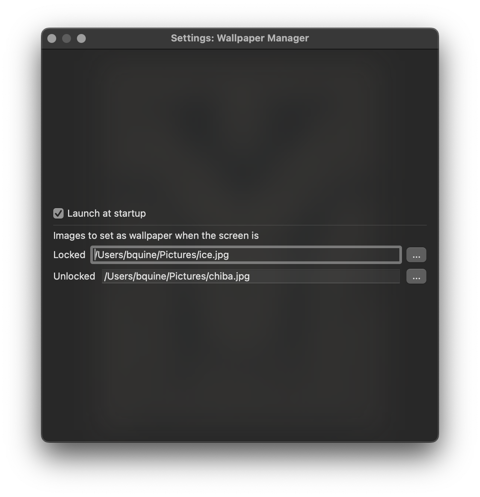

# wallman
Wallpaper Manager for MacOS

Allows you to set different wallpapers for when the screen is locked or unlocked. Currently is not multi-desktop/space/screen aware but it should be do-able.

# Documentation
wallman runs as a MacOS MenuBar app.

* About: Shows information about this application
* Settings: Show Settings
* Enabled: You can temporarily toggle wallman on and off without changing your settings.
* Quit: Exits wallman.

## Settings

Select an image file for Locked and Unlocked. When the screen becomes locked or unlocked, wallman will try to set that respective image as the desktop wallpaper. Both are optional, empty or invalid images will do nothing.
